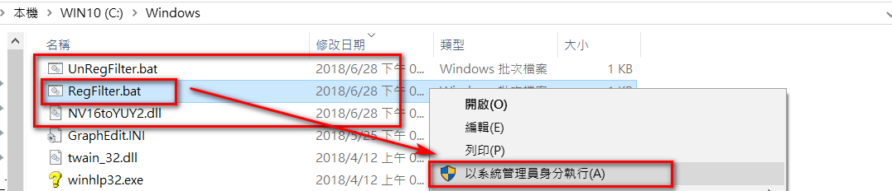
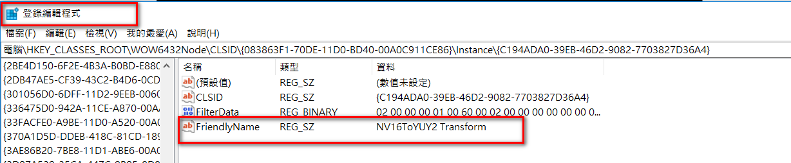
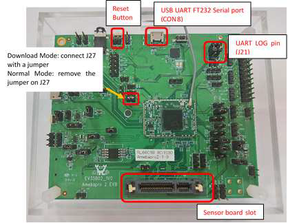
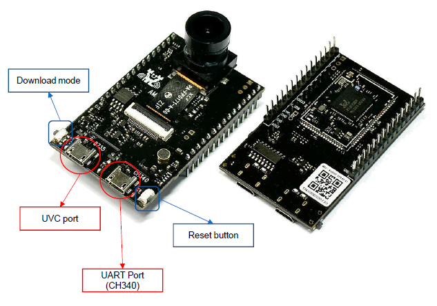

# RealCam Quick Start

© 2023 Realtek Semiconductor Corp. All rights reserved

## Table of Contents

1. [Tools, Firmware, and Other Files](#tools-firmware-and-other-files)
2. [RealCam Activation Key Registration](#realcam-activation-key-registration)
3. [NV16/NV12 to YUY2 DLL Registration](#nv16nv12-to-yuy2-dll-registration)
4. [How to Update Firmware](#how-to-update-firmware)
   - [RTK EVB Log UART Setting and Download Mode](#rtk-evb-log-uart-setting-and-download-mode)
   - [AMB82-mini Log UART Setting and Download Mode](#amb82-mini-log-uart-setting-and-download-mode)
   - [Firmware Update](#firmware-update)

---

# Tools, Firmware, and Other Files 

| File | Description |
|---|---|
| `Calibration_video` | ISP calibration training course (located in released assets)|
| `IQPackTool` | Binary package tool, also included in RealCam |
| `x86_Release_AmebaPro_20231107_IQ1000C` | RealCam tool |
| `[RealCam][20201026] NV12_NV16toYUY_Filter_dll` | Video decoding/conversion library registration files |
| `flash_ntz_uvc_f37_20250613(AMB82_Default).bin` | Firmware for AMB82 with active UVC mode and the default optical configuration |
| `flash_ntz_uvc_gc2053_20250613(EVB_Default).bin` | Firmware for RTK EVB with active UVC mode and the default optical configuration |
| `Pro2_PG_tool+_v1.4.3_B.zip_signed` | Tool used to upload firmware to RTK EVB or AMB82 |


# RealCam Activation Key Registration

To activate RealCam, please send the dump file `Realcam_activation.bin` to Realtek FAE, you will be issued an activation key to complete the registration.

# NV16/NV12 to YUY2 DLL Registration

Please copy the registration file to the `C:\Windows` directory, and perform registration as a system administrator



Then, kindly execute `regedit` to check the registration list, there should be registration information as shown below



# How to Update Firmware

## RTK EVB Log UART Setting and Download Mode



1. Connect the jumpers to `J21` to enable the FT232 interface through `COM8`.
2. Connect `COM8` to the PC.
   - The assigned COM port may vary depending on the PC.
3. Open a serial console application, such as:
   - Tera Term
   - MobaXterm
4. Configure the serial connection with a baud rate of:

   ```text
   115200
   ```

### How to use Download mode
1. Connect J27 with jumper
2. Push reset button

## AMB82-mini Log UART Setting and Download Mode



1. Connect the AMB82-mini UART port directly to the PC.
2. Open a serial console application, such as:
   - Tera Term
   - MobaXterm
3. Configure the serial connection with a baud rate of:

   ```text
   115200
   ```

### How to use Download mode
1. Press and hold the Download Mode button.
2. While holding the button, press the Reset button.
3. Release the Download Mode button after the board enters download mode.


## Firmware Update
Follow the firmware update procedure described in the online documentation:

[AmebaPro2 Image Tool and Firmware Update Guide](https://ameba-doc-rtos-pro2-sdk.readthedocs-hosted.com/en/latest/application_note/04_IMAGE.html)


### Required Programming Tool

   ```text
   Pro2_PG_tool+_v1.4.3_B.zip
   ```

### Command to Write Whole Image to NOR Flash

   ```text
   uartfwburn -p <COM_PORT> -f flash_ntz.bin -b 3000000 -U
   ```

### Firmware Selection

| Target Board | Firmware File |
|---|---|
| AMB82 | flash_ntz_uvc_f37_20250613(AMB82_Default).bin |
| RTK EVB | flash_ntz_uvc_gc2053_20250613(EVB_Default).bin |

### Update Procedure
1. Connect the target board to the PC.
2. Put the board into Download Mode.
3. Start the Pro2 PG Tool.
4. Select the firmware file that matches the target board.
5. Start the firmware upload process.
6. Wait until the programming process completes successfully.
7. Reset or power-cycle the board.
8. Check the UART log to confirm that the new firmware starts correctly.

| Important: Do not disconnect the USB cable or power off the board while the firmware is being programmed.

© 2023 Realtek Semiconductor Corp. All rights reserved